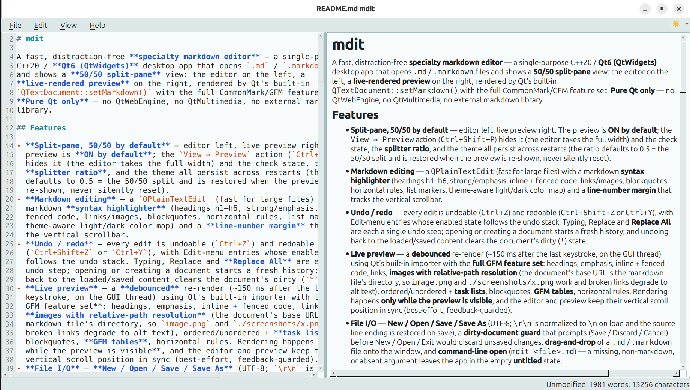

# mdit

A fast, distraction-free **specialty markdown editor** — a single-purpose
C++20 / **Qt6 (QtWidgets)** desktop app that opens `.md` / `.markdown` files
and shows a **50/50 split-pane** view: the editor on the left, a
**live-rendered preview** on the right, rendered by Qt's built-in
`QTextDocument::setMarkdown()` with the full CommonMark/GFM feature set.
**Pure Qt only** — no QtWebEngine, no QtMultimedia, no external markdown
library.

[](https://github.com/patw/mdit/actions/workflows/ci.yml)
[](https://github.com/patw/mdit/actions/workflows/release.yml)
[](https://github.com/patw/mdit/releases)
[](LICENSE)




*mdit editing this very README — source left, live preview right.*

## Features

- **Split-pane, 50/50 by default** — editor left, live preview right. The
  preview is **ON by default**; the `View → Preview` action (`Ctrl+Shift+P`)
  hides it (the editor takes the full width) and the check state, the
  **splitter ratio**, and the theme all persist across restarts (the ratio
  defaults to 0.5 = the 50/50 split and is restored when the preview is
  re-shown, never silently reset).
- **Markdown editing** — a `QPlainTextEdit` (fast for large files) with a
  markdown **syntax highlighter** (headings h1–h6, strong/emphasis, inline +
  fenced code, links/images, blockquotes, horizontal rules, list markers,
  theme-aware light/dark color map) and a **line-number margin** that tracks
  the vertical scrollbar.
- **Undo / redo** — every edit is undoable (`Ctrl+Z`) and redoable
  (`Ctrl+Shift+Z` or `Ctrl+Y`), with Edit-menu entries whose enabled state
  follows the undo stack. Typing, Replace and **Replace All** are each a single
  undo step; opening or creating a document starts a fresh history; and undoing
  back to the loaded/saved content clears the document's dirty (`*`) state.
- **Live preview** — a **debounced** re-render (~150 ms after the last
  keystroke, on the GUI thread) using Qt's built-in importer with the **full
  GFM feature set**: headings, emphasis, inline + fenced code, links,
  **images with relative-path resolution** (the document's base URL is the
  markdown file's directory, so `image.png` and `./screenshots/x.png` work and
  broken links degrade to alt text), ordered/unordered + **task lists**,
  blockquotes, **GFM tables**, horizontal rules. Rendering happens **only
  while the preview is visible**, and the editor and preview keep their
  vertical scroll position in sync (best-effort, feedback-guarded).
- **File I/O** — **New / Open / Save / Save As** (UTF-8; `\r\n` is normalized
  to `\n` on load and the source line ending is restored on save), a
  **dirty-document guard** that prompts (Save / Discard / Cancel) before
  New / Open / Exit would discard unsaved changes, **drag-and-drop** of a
  `.md` / `.markdown` file onto the window, and **command-line open**
  (`mdit <file>.md`) — a missing, non-markdown, or absent argument leaves
  the app in the empty **untitled** state.
- **Find / Replace** — `Ctrl+F` find and `Ctrl+H` replace in a small overlay
  bar over the editor: match highlighting with **`"i of n"` counts**,
  next/previous with **match wrap**, a case-sensitivity toggle, **Replace**
  (current match, then advances) and **Replace All**.
- **Status bar** — a **word/char count** (refreshed on the preview debounce
  and immediately on open/new, so it stays current even while the preview is
  hidden), a live **modified/unmodified indicator** (O(1), flips on every
  dirty-state change), and status messages (e.g. `Opened <path>`, `Saved
  <name>`, `Exported <name>`).
- **Light / Dark theme** — a `View → Theme` toggle (`Ctrl+T`) with three
  persisted modes (**auto** / light / dark; auto follows the platform color
  scheme). Applying a theme re-themes the whole app (Fusion style + palette +
  application QSS), the editor highlighter, and the preview stylesheet, so
  both panes always match.
- **Export** — `File → Export → HTML...` / `File → Export → PDF...` reuse the
  **same `RenderedDocument` path the preview uses** ("what you preview is what
  you export"): HTML is written as a standalone, theme-styled page with
  relative image references **copied next to the saved file**; PDF is printed
  into a `QPdfWriter` (A4 portrait, configurable DPI). Exports never change
  the document's dirty state.
- **Recent files** — a `File → Recent Files` submenu of the last 5
  opened/saved paths (persisted, most-recent-first); clicking an entry
  reopens its file, dirty guard first.
- **Find & Replace popup** — `Ctrl+F` / `Ctrl+H` open a small, non-modal
  **popup window centered over the app** (its own title bar names the mode:
  "Find" / "Find and Replace") instead of a bar glued under the menu bar. It
  shows `i of n` matches, wraps next/previous, has a match-case toggle, and
  Replace / Replace All act on the document (Replace All is one undo step). Esc
  closes it and the focus returns to the editor.
- **One row of chrome** — the standard **File / Edit / View / Help menu bar** and
a status bar; there is deliberately **no toolbar** (its New/Open/Save/Preview
buttons only duplicated the menus in a second row).
- **Theming system: modes x accents x UI scale** — the palette is generated
  from named **tokens**, not hardcoded light/dark values (adapted from PengyCPP):
  three **modes** (**System** / **Light** / **Dark**) x eight **accents**
  (**Default**, Blue, Teal, Green, Orange, Red, Pink, Purple) = 16 palettes that
  tint the chrome, the editor and the preview, plus a **UI scale** (75–200%) that
  multiplies the fonts and the widget metrics. Everything is persisted; the
  menu-bar corner button shows the mode (☀️/🌙) and its arrow opens the whole
  theme menu, ``Ctrl+T`` flips light/dark.
- **App icon** — the Pengy-style mark: a solid **white disc with a transparent
  outside**, carrying a bold **`#`** (the markdown heading element). It is
  generated by `tools/make_icon.py` (PNGs for 16…512 px + a scalable
  `assets/mdit.svg`) and **compiled into the binary** via `resources/mdit.qrc`,
  so the window, taskbar and launcher show it with no external files.
- **Undo / redo** — `Ctrl+Z` / `Ctrl+Shift+Z` (+ `Ctrl+Y`) with Edit-menu
  entries that follow the undo stack.
- **Unsaved-changes guard** — closing the window (title-bar **X**, `File →
  Exit` / `Ctrl+Q`, or a session quit) asks **Save / Discard / Cancel** just like
  New and Open; Cancel keeps the window open.

## Build

## Packaging & releases

Every push builds and tests on **Linux, macOS and Windows**
(`.github/workflows/ci.yml`); pushing a **`v*` tag** builds the four deployables
and attaches them to a GitHub Release (`.github/workflows/release.yml`):

| Platform | Artifact | Built by |
|---|---|---|
| Linux | `mdit_<version>_amd64.deb` | `build_deb.sh` (payload straight from `cmake --install`) |
| Linux | `mdit-x86_64.AppImage` | `build_appimage.sh` (linuxdeploy + the Qt plugin, **Wayland bundled**) |
| macOS | `mdit-<version>-macOS.dmg` | `build_macos.sh` (macdeployqt, `.icns` generated from the PNGs) |
| Windows | `mdit-<version>-Windows.zip` | `build_windows.bat` / CI (`windeployqt`) |

Before tagging, run the pre-flight:

```sh
./check_release.sh            # version consistency, icon sizes, docs, clean build + full suite
./check_release.sh v0.2.0     # ...and check the tag matches the project version
git tag v0.2.0 && git push --tags
```

### Install (Linux)

```sh
sudo apt install ./mdit_0.1.0_amd64.deb   # binary + .desktop + icons, caches refreshed
```

The `.deb` installs `/usr/bin/mdit`, `/usr/share/applications/mdit.desktop`
(`Icon=mdit`, `StartupWMClass=mdit`) and the mark at every hicolor size
(32…512), and its `postinst` runs `update-desktop-database` +
`gtk-update-icon-cache` so the entry and its icon appear for every user -
dock/taskbar included - without a logout. Prefer no root? Grab the AppImage
(`chmod +x mdit-x86_64.AppImage && ./mdit-x86_64.AppImage notes.md`) or install
per-user with `cmake --install build --prefix ~/.local`.

### Prerequisites

- CMake **≥ 3.22**
- Ninja (or any CMake-supported generator)
- A C++20 compiler (GCC or Clang)
- **Qt6** with the **Widgets**, **Gui**, and **PrintSupport** components
  (PrintSupport powers PDF export), plus `Qt6::Test` for the test suite.
  No other third-party dependencies.

On Debian/Ubuntu:

```sh
sudo apt install cmake ninja-build g++ qt6-base-dev
```

### Build from source

```sh
cmake -S . -B build -DBUILD_TESTS=ON -G Ninja && cmake --build build
```

This produces `build/mdit` (a `.app` bundle on macOS, a windowed `.exe` on
Windows). Turn tests off with `-DBUILD_TESTS=OFF` if you only want the app.

## Run

```sh
./build/mdit                    # open an empty (untitled) document
./build/mdit path/to/notes.md   # open a specific markdown file
```

`mdit <file>.md` opens the file when the path exists and is a `.md` /
`.markdown` file (a missing path, a directory, or a non-markdown file is a
"bad argument" — the app loads **only** markdown — and leaves the app in the
empty untitled state). Opening a file — from the command line or by dragging
it onto the window — shows the opened path in the status bar.

## Usage

| Action           | Shortcut       |
|------------------|----------------|
| New              | `Ctrl+N`       |
| Open             | `Ctrl+O`       |
| Save             | `Ctrl+S`       |
| Save As          | `Ctrl+Shift+S` |
| Undo             | `Ctrl+Z`       |
| Redo             | `Ctrl+Shift+Z` / `Ctrl+Y` |
| Find             | `Ctrl+F`       |
| Replace          | `Ctrl+H`       |
| Toggle preview   | `Ctrl+Shift+P` |
| Toggle theme     | `Ctrl+T`       |

Menus:

- **File** — New, Open…, Save, Save As…, **Export** (→ HTML…, PDF…),
  **Recent Files** (last 5, most-recent-first), Exit.
- **Edit** — Undo (`Ctrl+Z`), Redo (`Ctrl+Shift+Z` / `Ctrl+Y`), Find…
  (`Ctrl+F`), Replace… (`Ctrl+H`). The undo keys are scoped to the document
  editor, and Find/Replace open the centered popup window (Esc closes it and
  focuses the editor again).
- **View** — Preview (checkable, ON by default), **Toggle light/dark**
  (`Ctrl+T`), **Theme ▸** (System / Light / Dark), **Accent ▸** (Default, Blue,
  Teal, Green, Orange, Red, Pink, Purple), **UI Scale ▸** (75%, 100%, 110%,
  125%, 150%, 175%, 200%). The sun/moon button in the menu bar's right-hand
  corner is the same toggle, and its arrow opens all of the above.
- **Help** — About mdit — a small dialog with the mark, the version, the
  tagline, the ©/MIT line and a clickable Catbee link.

Preferences (theme mode, accent, UI scale, preview visibility, splitter ratio,
recent files) persist in Qt's standard application-settings location for `mdit`.

### Theming

| | |
|---|---|
| **Mode** | `System` (follows the desktop's colour scheme), `Light`, `Dark` |
| **Accent** | `Default`, `Blue`, `Teal`, `Green`, `Orange`, `Red`, `Pink`, `Purple` |
| **UI scale** | 75% … 200% (a direct multiplier on fonts + widget metrics) |

The **shipped defaults are Light + Default accent + 100% UI scale**, so a fresh
install always looks the same regardless of the desktop's colour scheme
(`System` is opt-in).

The accent tints the surfaces subtly and sets the highlight/link colour; it also
flows into the **editor's syntax highlighting** (headings, links) and the
**preview/export stylesheet**, so nothing is left on the old palette. The
`Default` accent is mdit's original neutral look, so the app is unchanged unless
you pick a colour.

**UI scale** is deliberately *on top of* Qt's own DPI handling: Qt still scales
for the monitor, and this multiplies the fonts and the explicit widget metrics
(the same model PengyCPP uses). Mode, accent and scale are all remembered across
runs.

## Icon

The mark (a white disc with a `#`, mirroring the [Pengy](https://mem.catbee.ca)
icon) lives in `assets/icons/` — generated, not hand-edited, by:

```sh
python3 tools/make_icon.py   # needs Pillow (generation only, not a build dep)
```

`resources/mdit.qrc` compiles those PNGs into the binary; `cmake --install`
additionally installs them into the hicolor icon theme and drops
`packaging/mdit.desktop` into `share/applications`.

Under **Wayland** a compositor ignores window icons: the dock/taskbar shows the
`Icon=` of the `.desktop` entry whose name matches the app's *desktop file name*,
which is why `main()` sets `QGuiApplication::setDesktopFileName("mdit")`. To get
the mark in the Ubuntu dock without root:

```sh
cmake --install build --prefix ~/.local      # ~/.local/bin/mdit + hicolor icons + the .desktop
# then relaunch mdit (it is on PATH) and, if you want it permanent,
# right-click its dock icon -> Pin to Dash
```

If a dock ever shows a stale/generic icon after new artwork,
`gtk-update-icon-cache -f -t ~/.local/share/icons/hicolor` refreshes the cache.

## Tests

The test suite is C++ **QtTest** binaries driven by **CTest**, plus a pytest
build shim that configures, builds, and runs it:

```sh
cmake -S . -B build -DBUILD_TESTS=ON -G Ninja
cmake --build build
ctest --test-dir build --output-on-failure
# or, via the pytest shim:
pytest -q
```

All tests run headless under the Qt **offscreen** platform plugin and exercise
the module classes directly — the GUI is never shown. `test_github_ready`
guards the repository contract (README / LICENSE / CHANGELOG / spec /
CMakeLists), `test_icon` pins the icon's geometry/pixels and `test_findwindow`
the find popup's window behavior (21 CTest binaries in total).

## License

MIT License — see [LICENSE](LICENSE). Copyright (c) 2026 Pat Wendorf.
